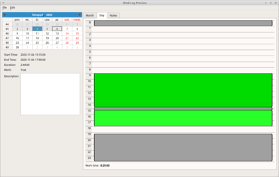

# Work Log

Track Your work sessions. Simply mark working time periods. 

## Features

- read activity from kern.log
- handle screensaver signals

## Screens

### Examples of not obvious Python mechanisms

- processing data in background thread preventing GUI blockage
- loading of UI files and inheriting from it
- properly killing (Ctrl+C) PyQt (*sigint.py*)
- persisting and versioning classes (*persist.py*)
